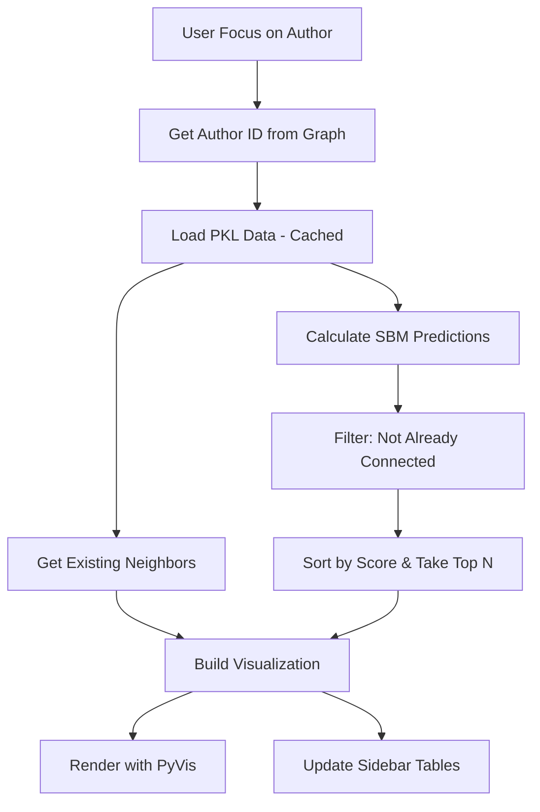

# Design Document: Link Prediction Feature

## Overview

Tính năng dự báo liên kết cho phép dashboard hiển thị các tác giả có khả năng hợp tác trong tương lai khi người dùng focus vào một tác giả cụ thể. Sử dụng model SBM (Stochastic Block Model) đã được train sẵn trong file `top3_models_optimized.pkl`.

### Data Structure từ PKL file

```python
{
    'top_3_meta': [
        {'model_name': 'SBM', 'threshold': 7.14e-06, 'metrics': {...}},
        {'model_name': 'PA', 'threshold': 51, 'metrics': {...}},
        {'model_name': 'PageRank', 'threshold': 2.22e-10, 'metrics': {...}}
    ],
    'graph': nx.Graph(),  # 69,559 nodes, 385,177 edges
    'id_map': {0: 'Author Name', ...},  # ID -> Name mapping
    'data_store': {
        'sbm': {
            'node_block': {node_id: block_id, ...},  # Node -> Community block
            'probs': np.ndarray(5619, 5619)  # Block-to-block probability matrix
        },
        'pagerank': {node_id: score, ...},
        'emb': ...,
        'tgn': ...
    }
}
```

## Architecture



## Components and Interfaces

### 1. Data Loading Module

```python
@st.cache_data
def load_prediction_data():
    """Load and cache the prediction model data from PKL file."""
    with open('top3_models_optimized.pkl', 'rb') as f:
        return pickle.load(f)
```

### 2. Prediction Calculator

```python
def get_link_predictions(
    author_id: int,
    prediction_data: dict,
    existing_graph: nx.Graph,
    top_n: int = 5
) -> List[Dict]:
    """
    Calculate top N predicted collaborators for an author.
    
    Args:
        author_id: Node ID of the focused author
        prediction_data: Loaded PKL data
        existing_graph: Current graph (for filtering existing connections)
        top_n: Number of predictions to return
    
    Returns:
        List of dicts: [{'id': int, 'name': str, 'score': float, 'score_pct': float}, ...]
    """
```

### 3. SBM Score Calculator

```python
def calculate_sbm_score(node_a: int, node_b: int, sbm_data: dict) -> float:
    """
    Calculate SBM link probability between two nodes.
    
    Uses: P(link) = probs[block_a][block_b]
    where block_a = node_block[node_a], block_b = node_block[node_b]
    """
```

### 4. Visualization Builder

```python
def add_predicted_edges_to_network(
    net: Network,
    center_id: int,
    predictions: List[Dict],
    id_map: dict
) -> None:
    """
    Add predicted nodes and dashed edges to PyVis network.
    
    - Predicted nodes: Different color (e.g., light purple)
    - Predicted edges: Dashed lines, semi-transparent
    """
```

## Data Models

### PredictionResult

```python
@dataclass
class PredictionResult:
    author_id: int
    author_name: str
    raw_score: float  # SBM probability
    normalized_score: float  # 0-100%
    
    @property
    def score_pct(self) -> str:
        return f"{self.normalized_score:.1f}%"
```

### VisualizationConfig

```python
EXISTING_EDGE_STYLE = {
    'color': {'inherit': 'from', 'opacity': 0.6},
    'dashes': False
}

PREDICTED_EDGE_STYLE = {
    'color': '#9B59B6',  # Purple
    'opacity': 0.5,
    'dashes': [5, 5],  # Dashed line pattern
    'width': 2
}

PREDICTED_NODE_STYLE = {
    'color': {
        'background': '#D7BDE2',  # Light purple
        'border': '#9B59B6'
    },
    'shape': 'dot',
    'borderWidth': 2
}
```

## Correctness Properties

*A property is a characteristic or behavior that should hold true across all valid executions of a system-essentially, a formal statement about what the system should do. Properties serve as the bridge between human-readable specifications and machine-verifiable correctness guarantees.*

### Property 1: Predictions are sorted and limited
*For any* author ID and any value of top_n, the returned predictions list SHALL be sorted by score in descending order AND have length <= top_n.
**Validates: Requirements 2.2**

### Property 2: Predictions exclude existing connections
*For any* author ID, all returned predictions SHALL NOT include any node that is already a neighbor of that author in the existing graph.
**Validates: Requirements 1.1**

### Property 3: Score normalization bounds
*For any* prediction result, the normalized_score SHALL be in the range [0, 100].
**Validates: Requirements 3.2**

### Property 4: SBM score calculation correctness
*For any* two nodes with known block assignments, the SBM score SHALL equal probs[block_a][block_b] from the probability matrix.
**Validates: Requirements 4.2**

### Property 5: Predicted edges have distinct styling
*For any* visualization with predictions, all predicted edges SHALL have dashes attribute set to a non-empty list AND color different from existing edges.
**Validates: Requirements 1.2, 1.3**

## Error Handling

| Scenario | Handling |
|----------|----------|
| PKL file not found | Display warning, disable prediction feature |
| Author not in prediction data | Show existing connections only, display info message |
| No valid predictions (all candidates already connected) | Display "No new predictions available" |
| SBM block not found for node | Skip that candidate, continue with others |

## Testing Strategy

### Unit Tests
- Test `calculate_sbm_score()` with known block assignments
- Test `get_link_predictions()` returns correct structure
- Test score normalization edge cases (0, max value)

### Property-Based Tests
- Use `hypothesis` library for Python
- Configure minimum 100 iterations per property test
- Each property test tagged with: `**Feature: link-prediction-feature, Property {N}: {description}**`

**Property tests to implement:**
1. Predictions sorted and limited (Property 1)
2. Predictions exclude existing neighbors (Property 2)
3. Normalized scores in [0, 100] (Property 3)
4. SBM calculation matches matrix lookup (Property 4)
5. Edge styling attributes present (Property 5)

### Integration Tests
- Test full flow: focus author → predictions displayed
- Test UI elements: legend present, slider functional

